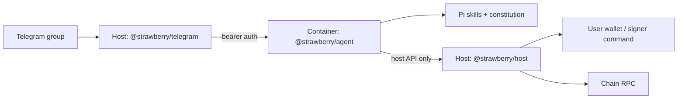

# Strawberry Architecture

## Runtime Topology



Production mode always uses this path. The agent never runs on the host beside Telegram.

## Three Boxes

| Box | Runs on | Holds secrets |
|---|---|---|
| Telegram | host | bot token |
| Agent | Apple Container | Pi model auth only |
| Host | host | RPC URL, signer, PK access |

## Apple Container Sandbox

- Agent runs in `strawberry-agent` Apple Container (lightweight Linux VM per container).
- Published to `127.0.0.1:${STRAWBERRY_AGENT_PORT:-4501}`.
- Host API binds `0.0.0.0:${STRAWBERRY_HOST_PORT:-4510}`; agent reaches it via the container bridge gateway (typically `192.168.64.1`).
- Guest→host auth uses `STRAWBERRY_HOST_API_KEY` (bearer). RPC URL and signer stay on macOS.

Persistent mounts: `.strawberry/`, `apps/`, `state/agent/`.

## Agent Image

Built from `ops/container/Dockerfile` via `strawberry` (or onboard image build). Node 24, pnpm, Foundry; OCI image run with mounted `config/agent.env`.

## Host API

Access control:

- `GET /api/health` — open on the service bind address
- `POST /api/chain/block` — sandbox only by default
- `POST /api/transactions/prepare|execute` — sandbox only by default

When the host binds beyond loopback, guest auth requires `STRAWBERRY_HOST_API_KEY` bearer token (container egress IP is not fixed).

Optional bearer auth also supports admin access from loopback tooling.

## Stack Scripts

- `packages/cli/src/init-config.ts` — create `config/*.env`, generate bearer tokens
- `packages/cli/src/runtime-env.ts` — host↔container URLs and keys
- `packages/cli/src/stack.ts` — build image, start/stop Telegram + host + container
- `ops/bin/start-host-api.sh` / `start-telegram-gateway.sh` — systemd entry points
- `ops/bin/verify-production.sh` — bash syntax and runtime TypeScript compatibility checks (via `pnpm verify`)
- `ops/MACOS.md` — Apple Container on macOS

## Install And Workspace Roots

The global `strawberry` command separates packaged code from user state:

- Install root: Strawberry package files, `ops/`, and the container Dockerfile.
- Workspace root: user config, apps, `.strawberry/`, state, and logs.

When run from a source checkout, both roots default to the checkout. When installed globally, the workspace defaults to `~/.strawberry/workspace` and can be changed with `STRAWBERRY_WORKSPACE_ROOT`.

## State Model

Restart-safe state:

- Telegram passive group context: `.strawberry/state/telegram/chats/*.jsonl`
- Agent sessions and Pi state: `state/agent/` (mounted into container)
- Host transaction ledger: `.strawberry/state/host/transactions.jsonl`
- Paired Telegram group: `.strawberry/state/telegram/registered-group.json`

## Trust Boundaries

- Telegram and host services run on the trusted host.
- The agent runtime runs only inside the Apple Container sandbox.
- Private keys and RPC URLs never enter the container.
- Skills call the host through `STRAWBERRY_HOST_BASE_URL`.
- Group passive context is not authorization for onchain actions.
- Remote binds fail closed unless bearer auth is configured; host health is intentionally low-detail and unauthenticated.
- Guest env files are validated so host-only RPC, signer, and Telegram bot secrets do not enter the container.
- No fallback from production mode to host-direct agent execution.

## Guest Request CLIs

Skills call fixed guest commands. Each command POSTs structured JSON to the host API.

```bash
pnpm --filter @strawberry/agent chain:block -- \
  --chat-id '<chat_id>' \
  --telegram-user-id '<telegram_user_id>' \
  --block 'latest'
```

Add new actions by copying `packages/agent/src/chain-block-request.ts` and wiring a host route in your handcrafted host server.

Host handlers that need Telegram uploads should use `fetchGuestUpload()` from `@strawberry/host/guest-upload`.

## Feature Map

- Telegram gateway: `packages/telegram/src/gateway.ts`
- Telegram routing and `/new`: `packages/telegram/src/routing.ts`, `packages/telegram/src/commands.ts`
- Telegram prompt formatting: `packages/telegram/src/prompt.ts`
- Agent HTTP API: `packages/agent/src/server.ts`
- Agent sessions: `packages/agent/src/runtime.ts`
- Host access control: `packages/host/src/access.ts`
- Guest host request clients: `packages/agent/src/host-request-common.ts`, `packages/agent/src/chain-block-request.ts`
- Host guest upload fetch: `packages/host/src/guest-upload.ts`
- Host transaction API: `packages/host/src/server.ts`

## Non-Goals In This Repo

- No vtubing, OBS, Live2D, stream publishing, GPU render plane, or Pump livestream code.
- No custodial wallet service.
- No host-direct production agent execution.
